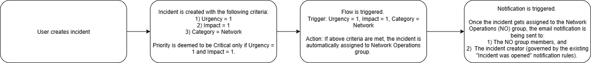

# Critical Network Incident Notification Workflow

This project fixes a critical issue in the incident management workflow for high-priority network issues. It ensures that when a critical network incident is created in ServiceNow, it is automatically assigned to the correct group and email alerts are sent to the right people — preventing SLA breaches and reducing response times.

---

## System Overview

In this implementation, I addressed a failure in the notification workflow that allowed critical incidents (Urgency = 1, Impact = 1, Category = Network) to go unnoticed.  
The updated system now:

- Automatically assigns the incident to the Networking Operations group.
- Triggers a notification email to both the group members and the incident creator (by default to the incident creator).
- Operates entirely through Flow Designer using conditions and update record action.

---

## Implementation Steps

**Workflow Changes**
- Renamed the flow to Critical Network Incidents Alerts for clarity.
- Trigger condition set to:
  - Urgency = 1
  - Impact = 1
  - Category = Network
- Action: Update Record – Assign to `Networking Operations` group, which gets notified of the assignment via email.

**Testing & Validation**
- Created a critical incident with proper values.
- Verified both email notifications and assignment worked correctly.
- Confirmed group members received the message, and incident creator got a copy.

**Challenge**
I spent time thinking about how to ensure the Networking Operations group is notified even if the assignment group is left blank by the caller or incident handler.  
I realized that once the incident is reassigned by the flow, the target group receives an automatic notification. This eliminated the need to send a separate notification manually.

---

## Architecture Diagram

---

## Contents

This repository contains two main components:

- `service-now-urgent-incident-notification-workflow.xml` — ServiceNow update set file.  
- `assets/Diagram.png` — A visual architecture diagram illustrating the entire flow of the incident lifecycle.

---

## AI Scenario (Future Enhancement)

To further improve incident routing, an AI agent could enhance the current setup by:

- **Matching tickets by expertise:** The AI agent will be able to assign the ticket to and/or notify the engineers who have resolved tickets with similar name conventions and descriptions in the past and whose queue looks less busy compared to others. This would allow to match the issue with the engineers who possess relevant knowledge and experience.
- **Considering availability:** The AI agent will be able to assign the ticket to and/or notify the engineers who are currently available (filtered by last logged on or last seen) regardless of the time zone they are located in as opposed to assigning it to a random engineer who might be off for the day and/or on vacation.
- **Learning from history:** The AI agent will be able to assign the ticket to and/or notify the engineers (based on the ticket name and description) who have successfully resolved similar issues in the past. Over time, it will improve how incidents are routed by matching new tickets to the engineers who have consistently demonstrated the ability to resolve them quickly and efficiently.
